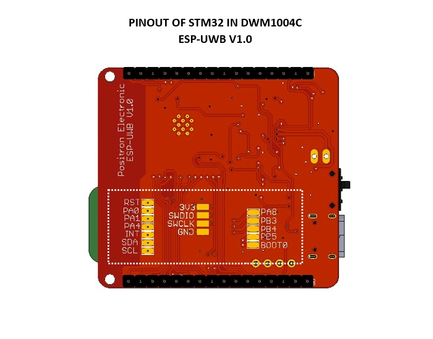
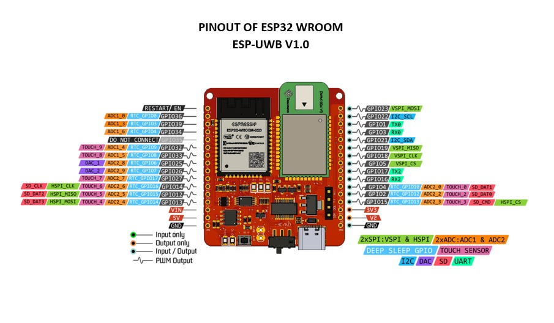
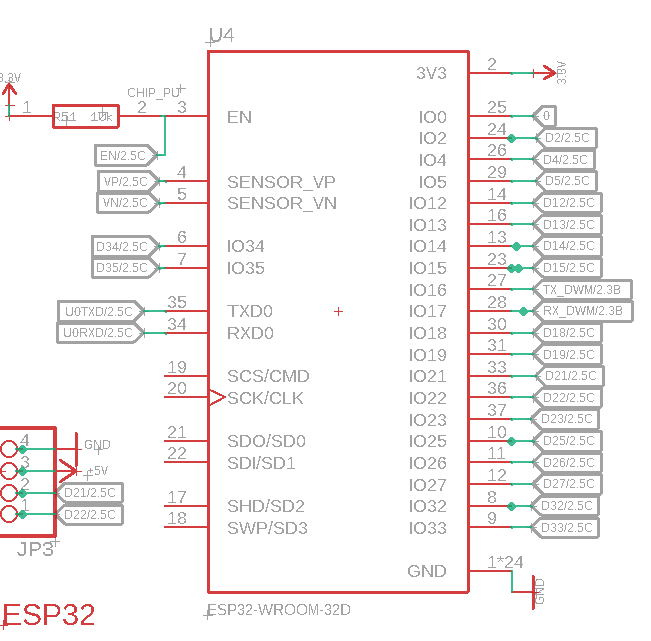
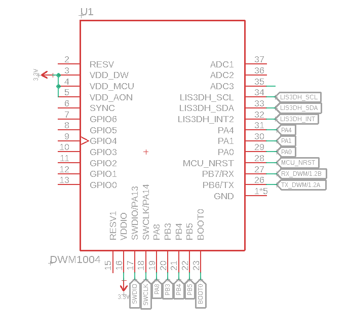

# ESP-UWB
This is PCB or Modul that combine ESP32 WROOM and DWM1004C in one Board, all pin are connected to header like ESP32 DEV KIT, and DWM1004C some pin are connected to SMD PAD on Bottom of PCB. You can find the gerber file, BOM LIST file and schematic file on this repository. 

## Table of Content

* [Product Specsification](#product-specsification)
* [Technical Spesification](#technical-spesification)
* [Priview Hardware](#priview-hardware)
* [Documentation](#documentation)
  * [Pinout Diagram](#pinout-diagram)
  * [Dimension](#dimension)
  * [BOM](#bom)
  * [Schematic](#schematic0)
  * [Example Program](#examples-program)
* [FAQ](#FAQ)

## Product Specsification
- esp32 wroom
- dwm1004c
- connected with serial uart between esp and dwm
- header i2c for oled display
- header pinout esp32
- pad smd dwm1004c
- modul charger tp4056
- switch on off

## Technical Spesification

| Features                           | Value                |  
| ---------------------------------- | -------------------- |
| Microcontroller                    | ESP32                |
| UWB Chip                           | DWM1004c             |
| Dispaly                            | OLED 0.91 inch       |
| USB To UART                        | FTDI 232XS           |
| IC Charger                         | TP4056               |
| PSU                                | M3406 2.0V to 6.0V to 3.3V 800mA|

## Preview Hardware

  
  

## Documentation
### PINOUT

  

### Dimension
- [Dimension](https://github.com/juarendra/ESP-UWB/blob/main/HARDWARE/dimension_esp-uwb.pdf)
### BOM
- [BOM](https://github.com/juarendra/ESP-UWB/blob/main/DOC/BOM_ESP-UWB.csv)
### Schematic
- Not Available
### Example Program
- [Example Program](https://github.com/juarendra/ESP-UWB/tree/main/FIRMWARE)

## Detail Connection ESP32 to DWM1004c

  
  

ESP32 and DWM1004c are connection with serial , you can see that ESP32 use pin IO16 and IO7 for serial and connected with DWM1004C with pin PB7 and PB6. Serial Connection is interface that STM32L have, and STM32 connected with DMW1000 with SPI. You must flash STM32 for reading data from DWM1000 and send it VIA Serial to ESP32.

You can flash STM32L using STlink and connected to SMD pad on Bottom of PCB